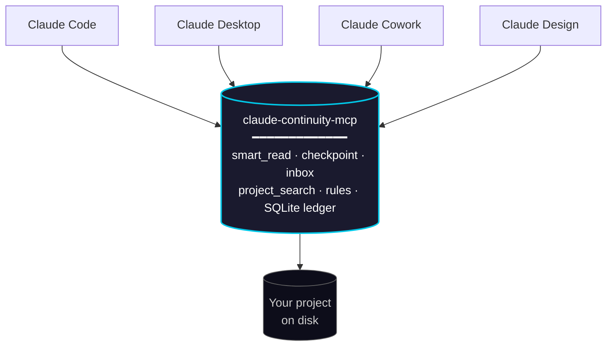

# claude-continuity-mcp — Persistent, Shared Memory for Claude

**Claude remembers a conversation. This MCP remembers a project.**

An MCP server that gives Claude something it doesn't have today: **memory that persists across sessions and is shared across all its clients** (Code, Desktop, Cowork, Design). It remembers which files you already read and returns only the diffs, resumes tasks where you left off, and coordinates orders between clients. 100% local, deterministic, no API keys.



Four different clients, one shared state: whatever one reads, decides, or leaves pending, any of the others inherits.

## Why it exists

Claude is amnesiac across sessions and blind across clients: what you read in Claude Code doesn't exist for Claude Desktop, and every new session re-reads the same files as if it were the first time. This MCP is the same local process shared by all your clients, with state persisted to disk — it's the memory Claude doesn't have. The token savings it produces are real, but they're a consequence, not the pitch: what sets the project apart is **continuity**.

## What it is — and what it is NOT

**It is:**

- Continuity: what was read/decided in one session stays available in the next, and in any other client.
- A layer so that 20,000-token files don't enter Claude's context whole when you only need 400.
- Deterministic where it matters: `smart_read` returns *exact* fragments of the file (local BM25/embeddings ranking) and *exact* diffs — never lossy summaries generated by a weaker model.

**It is NOT:**

- A "magic token saver" for your daily chat. If your session is normal conversation, this won't help you — and no tool will.
- A code compressor. Compressing code with cheap LLMs degrades Claude's answers and ends up costing more in retries. Never done here.

> **Note:** bulk processing on free models (formerly `router_bulk_process`) was split into its own repo, [`individra-bulk-offload`](https://github.com/gabicacabelos/individra-bulk-offload), because it's a different product: it depended on external services that diluted this 100%-local core.

## The 6 tools

### `router_smart_read` — Surgical reading with memory (local, $0, no APIs)

```
smart_read(file_path="docs/manual.md", query="where are webhooks configured?")
→ the 2-4 exact relevant fragments, with line numbers
```

- Small file (≤ ~6KB): returned whole, cleaned up.
- Large file + `query`: hybrid chunking + ranking (fastembed if installed, pure-Python BM25 if not) → only the relevant fragments. Typical savings: 70-90% of the file, **zero loss of fidelity**.
- Large file without `query`: structural map (outline with line numbers) to decide what to ask for.
- HTML: cleaned locally (scripts, tags, boilerplate stripped) before processing.

**Cross-session memory (diff reads):** every read gets recorded (hash + snapshot in a local SQLite file). In any future session, on any client:

- Unchanged file → `{"status":"unchanged","outline":[...]}` — ~50-100 tokens instead of thousands. In tests: 90 tokens vs. 10,195 for the file.
- Modified file → **only the unified diff** against the snapshot (99%+ measured savings).
- `force_full=true` skips memory when you need the full content.

### `router_checkpoint` — Context handoff between sessions and clients

```
checkpoint(action="save", name="refactor-auth",
           summary="Login migrated to JWT, refresh token still pending",
           decisions=["use RS256"], open_items=["expiration tests"],
           files=["src/auth.py"])
```

When closing a long task (or when context is filling up), Claude saves the state as human-readable JSON in `checkpoints/` — editable by you, shareable with your team. A new session — on Desktop, Code, or Cowork, doesn't matter — calls `action="resume"` and recovers everything in ~300 tokens, **including which files changed on disk since the checkpoint** (hash comparison, no re-reading). `action="list"` shows the available checkpoints.

**Cold start (no checkpoints saved):** `resume` never returns empty-handed. If nobody saved a checkpoint, it reconstructs a deterministic digest from the ledger and inbox — the last files touched (and whether they changed on disk since), plus recently completed orders. The payload declares `"mode": "reconstructed_activity"` explicitly: it's an activity trace, **not** an intentional checkpoint, and contains no architectural decisions.

### `router_inbox` — Cross-client orders

```
# In Cowork:
inbox(action="send", to="code", message="migrate the tests to pytest",
      checkpoint="refactor-auth")

# In Claude Code, on startup:
inbox(action="check", to="code")
→ the order + the linked checkpoint summary
inbox(action="complete", order_id=1, result="34/34 tests green")

# Back in Cowork:
inbox(action="history")  → you see the result
```

Claude chats can't command each other in real time — but they share this disk. The inbox is the async mailbox: you leave an order from one client (linked to a checkpoint so the receiver has the full context of what was being worked on), the other picks it up on startup, executes it, and reports the result. Tell Cowork *"leave this task for Claude Code"* and that's it — the server's `instructions` make each client check its inbox when starting work.

**Pack clients:** `cowork`, `code`, `desktop`, and `design` (Claude Design). Any of them can give orders to any other — the destination is free text, so you can also invent your own roles. For a client to receive orders it only needs to have this MCP loaded and check its inbox with `action="check"`.

**Code ↔ design handoff (`assets`):** orders and results can carry `assets` — a list of file paths or URLs (brief, wireframe, `.fig`/`.png` export, specs). That way the back-and-forth between development and design travels with the material, not just the text:

```
# Claude Code asks Claude Design for a mockup, with the material:
inbox(action="send", to="design", from_client="code",
      message="landing hero, dark + cyan accent",
      checkpoint="landing-v2",
      assets=["/proj/brief.md", "https://.../wireframe.png"])

# Claude Design, on startup, sees the order + the brief + the wireframe:
inbox(action="check", to="design")
inbox(action="complete", order_id=7, result="mockup ready, 2 variants",
      assets=["https://figma.com/.../hero", "/exports/hero-v1.png"])

# Claude Code sees the result and the returned export:
inbox(action="history")  → result + result_assets
```

And the other way around: Claude Design can leave `code` an order with the final export for implementation. The inbox is bidirectional between all clients.

### `router_status` — Honest session metrics

The headline metric is `tokens_kept_out_of_context`: tokens from the original sources that **didn't** enter Claude's context window. It also reports reads, memory hits (unchanged/diff), ledger state, and pending inbox orders. `deep=true` adds local diagnostics (fastembed/python).

### `router_project_search` — Search the whole project (incremental BM25)

```
project_search(project_dir="/proj", query="where are webhook signatures validated?")
→ the most relevant files, each with its exact fragments and line numbers
```

`smart_read` answers *"where is X in **this file**?"*. The question you usually have is *"where is X **in the project**?"* — and that's where Claude falls back to Grep.

- **Incremental index:** the first call indexes; later calls only re-index files whose hash changed (unchanged files cost ~0). On this repo: 23 files in 0.41s cold, **0.08s warm**.
- **Persistent and shared:** the index lives in the ledger, so it survives across sessions and clients. Grep starts from zero every time; this doesn't.
- **Better than literal grep for concepts:** ranks by relevance and splits `snake_case`/`camelCase`, so "webhook retry" finds `handleWebhookRetry()`.
- Deliberately bounded: skips `node_modules`, `.git`, `dist`, binaries and files >400KB. Deterministic, 100% local — exact fragments, never summaries.

### `router_rules` — Permanent project rules, with provenance

```
rules(action="add", project_dir="/proj", text="never use Redux", from_client="code")
rules(action="promote", project_dir="/proj", checkpoint="arch-decisions")  # a checkpoint decision → permanent rule
```

Distinct from the *task state* a checkpoint captures, a rule is a **permanent** project decision (`"never use Redux"`, `"tests go in tests/"`). Each one carries provenance: **who** decided it (client/human), **when**, and **which checkpoint** it came from. Rules live in `.claude-continuity-rules.json` at the project root — git-friendly, hand-editable, travels with the repo, and survives any change to Anthropic's APIs.

- **Deterministic:** the rule is literal text written by the human or promoted from a checkpoint's `decisions` — never a lossy LLM summary.
- **Zero-friction distribution:** you don't call the tool to *read* rules — they're injected as `project_rules` into `smart_read` and `resume` payloads for files in that project (piggybacking on calls that already happen).
- **Doesn't fight `CLAUDE.md`, feeds it:** `sync_to_claudemd=true` writes the rules into a delimited section (`<!-- INDIVIDRA RULES START/END -->`) of the project's `CLAUDE.md`, leaving your own content untouched — so Claude Code's native memory gets them too.

## Real savings (honest numbers)

| Scenario | Savings | Fidelity |
|---|---|---|
| Re-reading a known file, unchanged | 98-99% | 100% (outline + memory) |
| Re-reading a known file that changed | 90-99% | 100% (exact diff) |
| Resuming a task in a new session/client (resume) | ~300 tokens vs. re-exploring everything | 100% |
| Searching for something specific in a 20k-token file | 80-95% | 100% (exact fragments) |
| Ingesting dirty HTML/web content | 40-60% | 100% (only noise removed) |
| Normal conversational chat | ~0% | — |

The fixed overhead is ~500 tokens of tool definitions per session. If you're not processing large files or batches, that's your net cost: be honest with yourself about your use case.

## Installation

```bash
git clone https://github.com/gabicacabelos/claude-continuity-mcp.git && cd claude-continuity-mcp
pip install -r requirements.txt
# Optional (local semantic ranking for smart_read): pip install fastembed
```

No API key or `.env` file needed: all six tools are 100% local.

### Registering it across all your Claude sessions

**Claude Desktop / Cowork** — `claude_desktop_config.json`:

```json
{
  "mcpServers": {
    "claude-continuity": {
      "command": "python",
      "args": ["C:/path/to/claude-continuity-mcp/server.py"]
    }
  }
}
```

**Claude Code** (user scope = available in every project):

```bash
claude mcp add claude-continuity --scope user -- python /path/to/server.py
```

### User-invocable prompts (slash commands)

Continuity can't depend only on the model *choosing* to call these tools. The server exposes three MCP prompts that clients surface as slash commands, so **you** trigger the flow deterministically:

| Prompt | What it drives |
|---|---|
| `/resume` | Restore the latest checkpoint (or the cold-start digest) + check pending inbox orders + brief you on where work stands |
| `/handoff` | Save a checkpoint of this session and leave a linked order in another client's inbox (args: `to`, `message`) |
| `/inbox` | Check this client's inbox and execute pending orders end-to-end, marking each complete with evidence |

(Exact invocation varies by client — e.g. in Claude Code they appear under `/mcp__<server-name>__resume`.)

### Automatic activation

The server declares `instructions` that get injected into every session's system prompt, telling Claude when to use each tool without you having to ask. To reinforce it, add a line to your global `CLAUDE.md`:

```
To read files >15KB or search for something specific in them, use router_smart_read with a query.
When closing long tasks, save a router_checkpoint; when resuming, summarize it.
```

## Architecture

```
smart_read ──▶ sanitizer (HTML/text, local) ──▶ ledger (have I seen this?)
                    │                              ├─ unchanged → outline (~50 tok)
                    │                              └─ changed → unified diff
                    └──▶ ranker (with query)
                          ├─ fastembed (bge-small, local ONNX) if available
                          └─ pure-Python BM25 (fallback, 0 deps)
checkpoint ──▶ checkpoints/*.json (human-readable/editable) + hash verification on resume
inbox ──────▶ shared SQLite queue (orders between Cowork/Code/Desktop/Design + handoff assets + results)
rules ──────▶ .claude-continuity-rules.json at project root (git-friendly, provenance) → injected into smart_read/resume, optional CLAUDE.md sync
project_search ▶ incremental BM25 index in the ledger (re-indexes only changed hashes) → files ranked + exact fragments
hook (opt-in) ▶ PostToolUse → raw_reads staging table (WAL) → drained into the ledger by the MCP
```

Everything local: the ledger and the inbox are SQLite files on disk; checkpoints are readable/editable JSON. No network, no API keys, no external dependencies for the core.

## An MCP process doesn't auto-update itself

Each client launches `server.py` as its own process and keeps it alive for the duration of the session. Editing the code on disk — or running `git pull`/`git push` — does **not** affect a process that's already running: Python doesn't reload modules on its own. If you changed something and the new behavior isn't showing up, that's not a bug: restart the MCP (reconnect via `/mcp` or restart the client).

So you don't have to infer that by hand, `router_status` includes `code_staleness`: it compares the modification time of `server.py`/`router/*.py` against when the process started, and returns `{"stale": true, "changed_file": "...", "hint": "..."}` if the disk changed after boot. Additionally, when there's staleness, **every** tool injects a `code_stale` field into its response (with the changed file and a hint) — you find out on the very first call you make, without needing to remember to check `router_status`. In normal operation the field doesn't exist: it only appears if the code actually changed on disk after boot.

## Passive capture (optional, Claude Code only)

The memory only fills up when Claude *chooses* `router_smart_read`. If it uses its native `Read` instead, the ledger never finds out. An opt-in `PostToolUse` hook closes that gap: **value accumulates even when Claude never picks this MCP's tools.**

Add to your `.claude/settings.json`:

```json
{
  "hooks": {
    "PostToolUse": [
      {
        "matcher": "Read",
        "hooks": [{ "type": "command", "command": "python /path/to/claude-continuity-mcp/hooks/capture_read.py" }]
      }
    ]
  }
}
```

The hook is deliberately dumb: it does **one** INSERT into a staging table (`raw_reads`) and exits — no hashing, no file reading. The MCP later promotes those rows into the real ledger on its own time (`drain_raw_reads`), so the hook never pays that cost. The ledger runs in **WAL** mode so the hook (a separate process) and the MCP can write concurrently.

**Honest costs and caveats:**

- **~250ms per native `Read`**, almost entirely Python interpreter startup — not the DB write. If you read a lot of files, that adds up. Don't enable it if that bothers you; everything else works without it.
- If the DB is busy, the hook **discards the capture silently** (100ms SQLite timeout). Losing a capture is free; freezing your terminal is not.
- **Claude Code only.** Desktop/Cowork/Design have no hooks — there, memory still depends on the tools being called.
- It's coupling to an Anthropic-controlled API that can change. That's why it's opt-in and strictly additive: if the hook stops firing, nothing breaks.

## Hot configuration (`router_config.json`)

Runtime tunables can be adjusted **without restarting the MCP**. Copy `router_config.example.json` to `router_config.json` (next to `server.py`, gitignored) and edit what you need — the next call to any tool picks it up (the file is only re-parsed when its modification time changes, near-zero overhead):

| Key | Default | What it controls |
|---|---|---|
| `full_return_max_tokens` | `1500` | Threshold below which a file is returned whole |
| `default_top_k` | `4` | Fragments to return when the call doesn't pass `top_k` |
| `diff_max_ratio` | `0.6` | If the diff weighs more than this fraction of the file, it's not worth it and normal content is returned |
| `cache_enabled` | `true` | Query→fragments cache and embedding vector cache |

If `router_config.json` doesn't exist, the defaults apply (zero-config). **Logic** changes (new code in `server.py`/`router/`) still require a restart — that's unavoidable; hot config only removes restarts for tunable adjustments.

## Known limitations

- BM25 is lexical: a query with no words in common with the text degrades to the first chunks of the file. Installing `fastembed` improves semantic queries (requires onnxruntime compatible with your Python version).
- BM25 is lexical, project-wide too: `router_project_search` ranks by shared vocabulary, so a query with no words in common with the code degrades. It complements Grep and semantic search, it doesn't replace them.
- `code_staleness` detects that the code changed — it doesn't restart itself. Auto-restart isn't safe here: multiple clients may share the same process, and killing it mid-inbox-order would cut the tool out from under another session with no guarantee it comes back on its own.

## License

MIT — see `LICENSE`.
